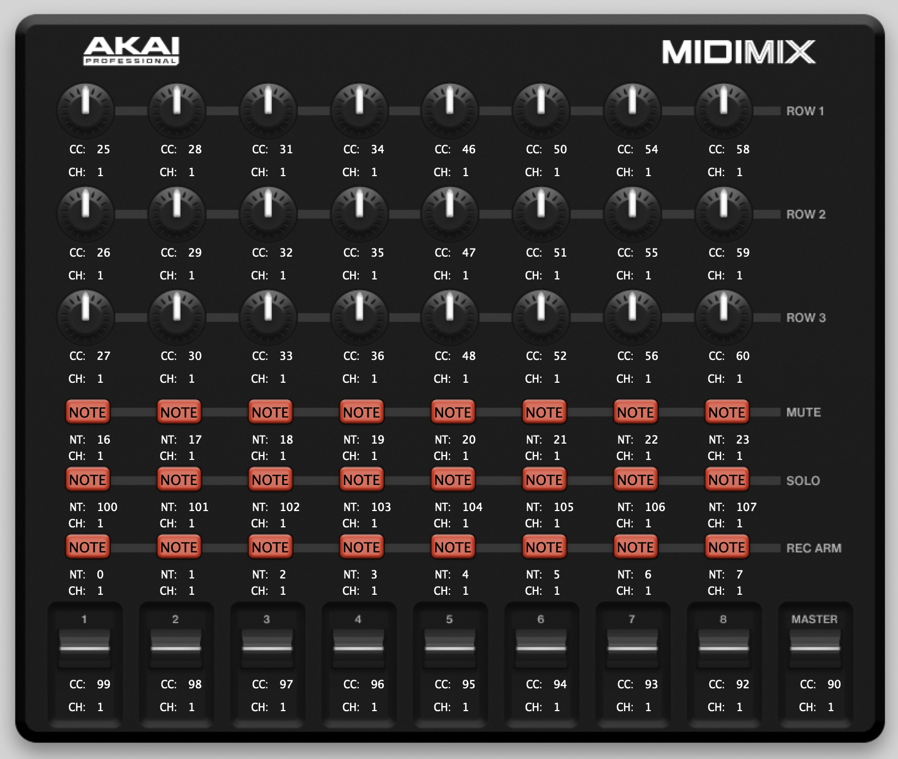

# Akai MidiMix Studio One Integration
This is the `AKAI Midimix` controller integration for `Presonus Studio One`

## Features
- [x] Use all faders, channels and master
- [x] Mute, Solo and Rec buttons are working
- [x] LEDs are working
- [x] Skip through the channel banks (currently 8 pages = 64 channels)

  ```xml
  <PlacementBank target="RemoteBank" pagesize="8" name="MixerBank">
  ```

- [x] Encoders working in global and focus mode

In `global` mode the encoders are set up as follows:
- Row 1 & 2: Adjust the `send level` for the first and second send insert.
- Row 3: Used for panorama

## Configuration and Installation
This repo contains three files that you need for the configuration:

### MidiMix Configuration

 `akai-midimix-studio-one-mapping.midimix`
  - Load this file into the MidiMix Editor that you can download at [https://www.akaipro.com/midimix](https://www.akaipro.com/midimix)
  - This is a required step because I changed the default settings
  - You can also set it by hand and use the following screenshot:




## Device & Surface XML

`Akai` folder with `*.device` and `*.surface.xml` files

Copy the `Akai` folder into the Studio One `User Devices` folder
  - Mac: `/Users/<username>/Library/Application Support/PreSonus/Studio One 5/User Devices`
  - Win: ? (maybe in `Application Data`, `Roaming` or something like that?)


## Contributions
Contributions are what make the open source community such an amazing place to learn, inspire, and create. Any contributions you make are greatly appreciated.

If you have a suggestion that would make this better, please fork the repo and create a pull request. You can also simply open an issue with the tag "enhancement". Don't forget to give the project a star! Thanks again!

Fork the Project
Create your Feature Branch (git checkout -b feature/AmazingFeature)
Commit your Changes (git commit -m 'Add some AmazingFeature')
Push to the Branch (git push origin feature/AmazingFeature)
Open a Pull Request

## License
Distributed under the GPL-3 License. See LICENSE.txt for more information.
